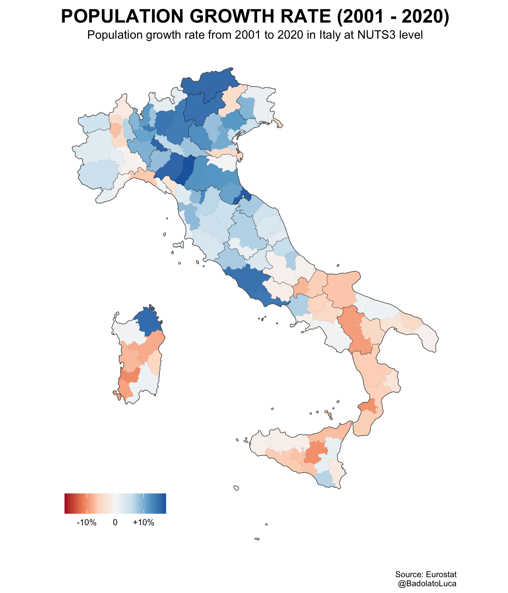

# IMPRS-2021-Data Visualization

Final assignment for the [Data Visualization course](https://www.demogr.mpg.de/en/career_6122/international_advanced_studies_in_demography_6682/courses_6931/data_visualization_the_art_skill_cocktail_7809/) taught by Ilya Kashnitsky at the MPIDR 

The task was to produce a map using any Eurostat statistics, following the codes and instructions presented during the course. I took the occasion to play a little bit with the tidyverse commands (I am just changing my mind to the tidy framework), computing a very simple and raw demographic indicator, the population growth from 2001 to 2020. Still, it is interesting to see substantial within-region variations: e.g. Sardinia reports the region with the highest population decline (Medio Campidano area, -10.4%) and another with a significant increase (Olbia, +15.4%). 

